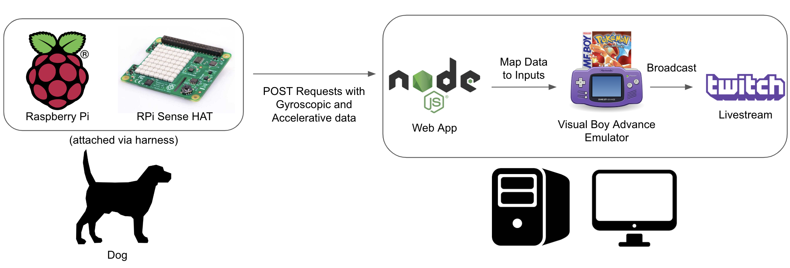

# DogsPlayPokemon

The official repo for the [blog post](https://engineering.videoblocks.com/playing-pokemon-with-office-dogs-and-a-raspberry-pi-49bf16811884).

An experiment to determine if dogs can beat Pokemon Red. The live-stream can be viewed on Twitch: https://www.twitch.tv/smrubin.

## Getting Started

### Server

The server is used as an HTTP server that handles incoming requests from the client (dogs with Raspberry Pi). It maps inputs from the JSON payload to inputs that will be sent to the emulator.

#### System Requirements

* Windows OS
* Node.js
* Python3
* pypiwin32 (`pip install pypiwin32`)
* Confirm Windows firewall is not blocking node.js requests

### Client

The client is used to broadcast sensor event data sent out as HTTP POST requests. This example client runs on a Raspberry Pi 3 with a Sense HAT (https://www.raspberrypi.org/products/sense-hat/). Follow this [guide](https://projects.raspberrypi.org/en/projects/getting-started-with-the-sense-hat/2) for setting up Sense HAT on the Raspberry Pi. See an emulated Sense HAT here: https://trinket.io/sense-hat

### Troubleshooting

Recalibrating the Sense HAT - https://www.raspberrypi.org/documentation/hardware/sense-hat/README.md
